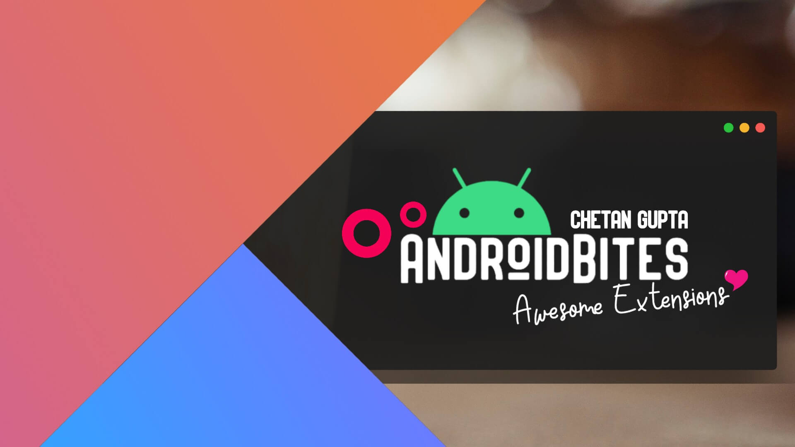

<h1 align="center">Awesome Android Extensions and DSLs- <a href="https://chetangupta.net" target="_blank">AndroidBites</a>
</h1>
    


<p align="center">
    A curated list of Awesome Kotlin Extensions. :octocat:
</p>

<p align="center">
  <a href="#"></a>
  <a href="#"></a>
</p>


## :hand: About
Hola Amigos! 🙌, Welcome to AndroidBites collection, this repo is a place where I keep all of my faviourite kotlin extension, some are creation of my own and other are gathered from various sources. So this is the one point stop where I point my fellow android devs 👩‍💻 to get some quality extensions. 

Btw do checkout my website 👉 [AndroidBites](https://chetangupta.net), I share all my stuff there, my learnings, my snippets, my research all are here. I believe in sharing so if you like to share too your always invited to contribute! 🤩

Let's grow together 💪🏻 ! happy hacking 💻.

P.S : Don't forget to show love and support 🥰 by sharing! & providing feedback! 📝 and PRs are always welcome

Chao!

## :eyes: Social
[LinkedIn](https://bit.ly/ch8n-linkdIn) | 
[Medium](https://bit.ly/ch8n-medium-blog) | 
[Twitter](https://bit.ly/ch8n-twitter) | 
[StackOverflow](https://bit.ly/ch8n-stackOflow) | 
[CodeWars](https://bit.ly/ch8n-codewar) |
[Portfolio](https://bit.ly/ch8n-home) |
[Github](https://bit.ly/ch8n-git) |
[Instagram](https://bit.ly/ch8n-insta) |
[Youtube](https://bit.ly/ch8n-youtube) 


## :memo: Contribution
Do checkout if you wanna add to action, 👉  [Contribution Guide](./contribution.md)


## :book: Content
* [Android-View-KTX](./android-view-ktx)
* [Json-KTX](./json-ktx)


## :cop: License
```
   Copyright [2020] [Chetan gupta] [chetangupta.net]
   Licensed under the Apache License, Version 2.0 (the "License");
   you may not use this file except in compliance with the License.
   You may obtain a copy of the License at

     http://www.apache.org/licenses/LICENSE-2.0

   Unless required by applicable law or agreed to in writing, software
   distributed under the License is distributed on an "AS IS" BASIS,
   WITHOUT WARRANTIES OR CONDITIONS OF ANY KIND, either express or implied.
   See the License for the specific language governing permissions and
   limitations under the License.

 ```

