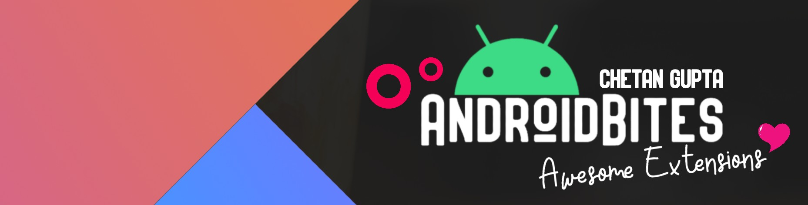

<h1 align="center">Awesome Android Extensions - <a href="https://chetangupta.net" target="_blank">AndroidBites</a>
</h1>



<p align="center">
    A curated list of Awesome Kotlin Extensions. :octocat:
</p>

<p align="center">
  <a href="#"></a>
  <a href="#"></a>
</p>

## :eyes: Social
[LinkedIn](https://bit.ly/ch8n-linkdIn) | 
[Medium](https://bit.ly/ch8n-medium) | 
[Twitter](https://bit.ly/ch8n-twitter) | 
[StackOverflow](https://bit.ly/ch8n-stackOflow) | 
[CodeWars](https://bit.ly/ch8n-codewar) |
[Portfolio](https://bit.ly/ch8n-home) |
[Github](https://bit.ly/ch8n-git) |
[Instagram](https://bit.ly/ch8n-insta) |
[Youtube](https://bit.ly/ch8n-youtube) 


## :memo: Contribution
See [contributing.md](contribution.md)

## Android Click KTX
Useful extension for click behaviour for your views

### :book: Content
* [Debounce click listener](#debounce)
* [Double click listener](#double)

---

### <a name="debounce"/> Debounce click listener
Useful to debounce/throttle mutiple click on a view.
```kotlin
/**
*  [Submitted by] : Chetan Gupta 
*  [Updated on] : 21/9/2020
**/
inline fun View.onDebounceClick(debounceInMillis: Long = 1200L, crossinline action: () -> Unit) {
    this.setOnClickListener(object : View.OnClickListener {
        private var lastClickTime: Long = 0
        override fun onClick(v: View) {
            if (SystemClock.elapsedRealtime() - lastClickTime < debounceTime) return
            else action()
            lastClickTime = SystemClock.elapsedRealtime()
        }
    })
}
```
#### Usage
```kotlin
button.onDebounceClick(debounceInMillis = 1500L){
    // do stuff..
}
```
---

### <a name="double"/> Double click listener
Useful to simulate double click on a view in a specificed time interval
```kotlin
/**
*  [Submitted by] : Chetan Gupta 
*  [Updated on] : 21/9/2020
**/
inline fun View.onDoubleClick(intervalMillis: Long = 1500L, crossinline action: () -> Unit) {
    var count = 0
    var firstClickRecord: Long = 0
    var secondClickRecord: Long = 0
    this.setOnClickListener {
        count += 1
        when (count) {
            1 -> firstClickRecord = Calendar.getInstance().timeInMillis
            2 -> {
                secondClickRecord = Calendar.getInstance().timeInMillis
                if (abs(firstClickRecord - secondClickRecord) < interval) {
                    action()
                }
                count = 0
            }
        }
    }
}

```
#### Usage
```kotlin
button.onDoubleClick(intervalMillis = 1200L){
    // do stuff..
}
```

## :cop: License
```
   Copyright [2020] [Chetan gupta] [chetangupta.net]
   Licensed under the Apache License, Version 2.0 (the "License");
   you may not use this file except in compliance with the License.
   You may obtain a copy of the License at

     http://www.apache.org/licenses/LICENSE-2.0

   Unless required by applicable law or agreed to in writing, software
   distributed under the License is distributed on an "AS IS" BASIS,
   WITHOUT WARRANTIES OR CONDITIONS OF ANY KIND, either express or implied.
   See the License for the specific language governing permissions and
   limitations under the License.

 ```


